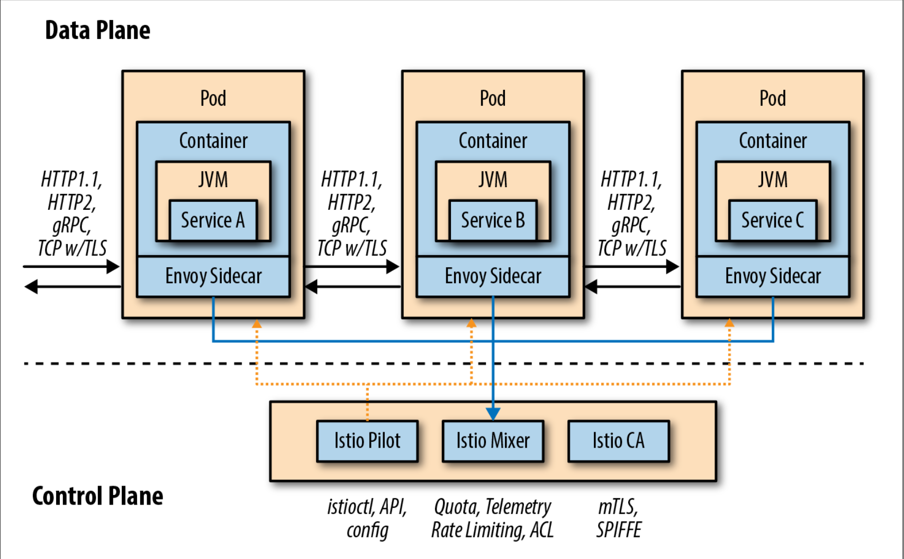

# Istio

## Service Mesh

Service mesh is the connective tissue between your services that adds additional
capabilities like *traffic control*, *service discovery*, *load balancing*,
*resilience*, *observability*, *security*, and so on. A service mesh allows
applications to offload these capabilities from application-level libraries
and allows developers to focus on differentiating business logic.

## Istio

- Data Plane

- Control Plane
