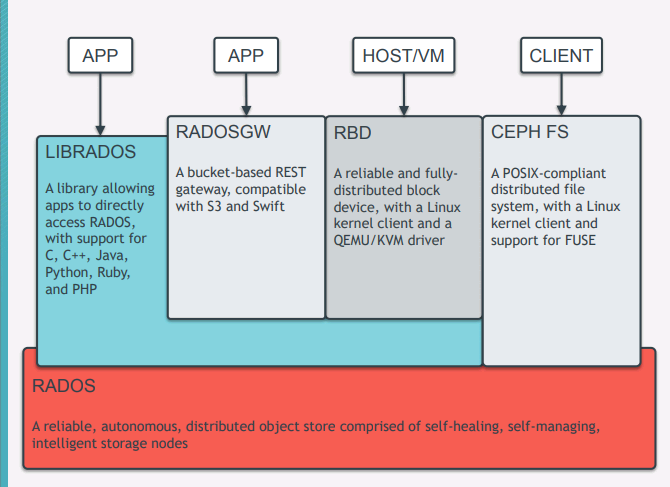
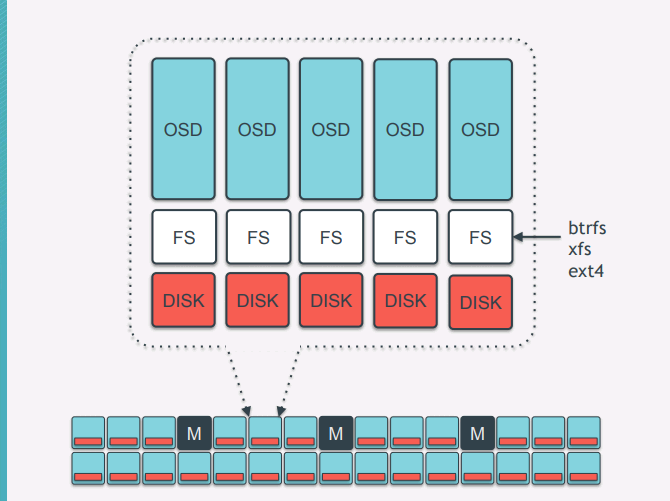
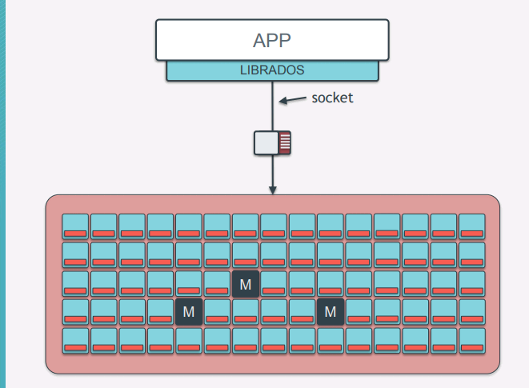
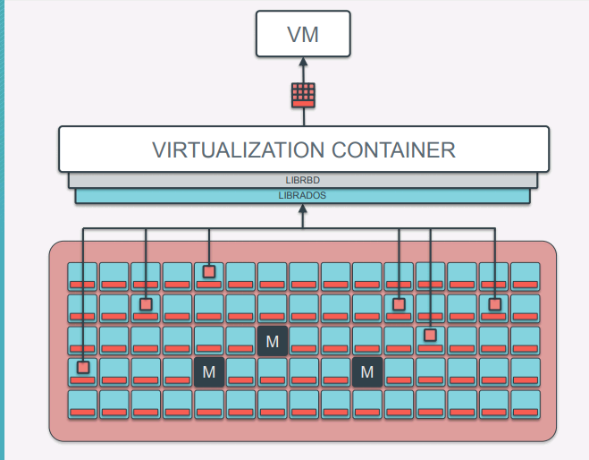
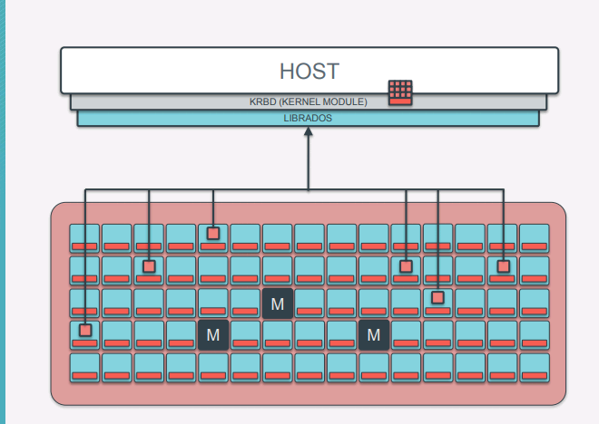
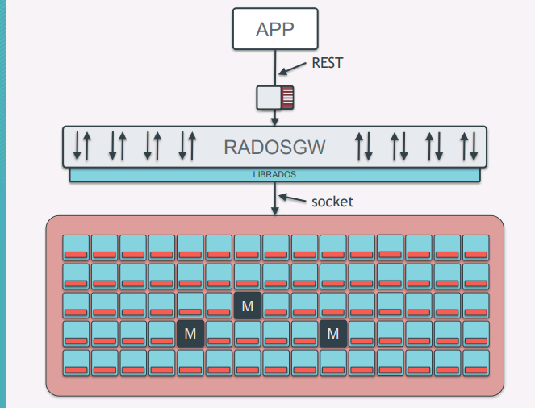
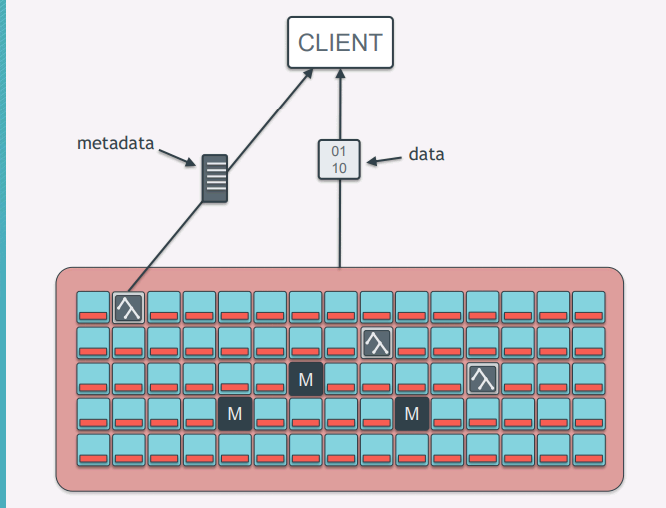

# Ceph 评估报告

## Ceph 架构原理

### 架构

### 存储节点

### Rados 接口

### 块存储

#### 虚拟机

#### 主机

### 对象存储

### 文件系统

## CEPH 性能测试

### Test Cluster (CentOS Ceph Cluster)

| Host Name | IP (192.168.0.0/24) | Disk           | Ceph Service |
| --------- | ------------------- | -------------  | ------------ |
| client    |       192.168.3.100 | /dev/{sda,sdb} | N/A          |
| node0     |       192.168.3.101 | /dev/{sda,sdb} | osd,mon,mgr  |
| node1     |       192.168.3.102 | /dev/{sda,sdb} | osd,mon,rgw  |
| node2     |       192.168.3.103 | /dev/{sda,sdb} | osd,mon,rgw  |
| node3     |       192.168.3.104 | /dev/{sda,sdb} | osd,mds      |

### Benchmark Baseline

- Disk

dd if=/dev/zero of=here bs=1G count=1 oflag=direct

- Network

iperf -s               # host1
iperf -c 192.168.1.1   # host2

### Benchmark

- Drop caches

sudo echo 3 | sudo tee /proc/sys/vm/drop_caches && sudo sync

#### rados

#### rbd

#### rgw

#### cephfs

## 业界应用情况

## 结论
