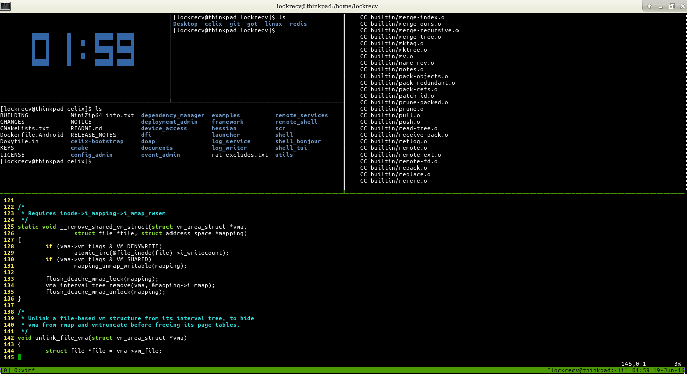

# tmux

### Multiplexer that makes your command line life colorful

```
| Command  |              Description          |
|----------|-----------------------------------|
| CTRL+B C | Create a window                   |
| CTRL+B " | Split current window horizontally |
| CTRL+B % | Split current window vertically   |
| CTRL+B W | List and toggle between windows   |
| CTRL+B Q | List and toggle between panels    |
```

> 
